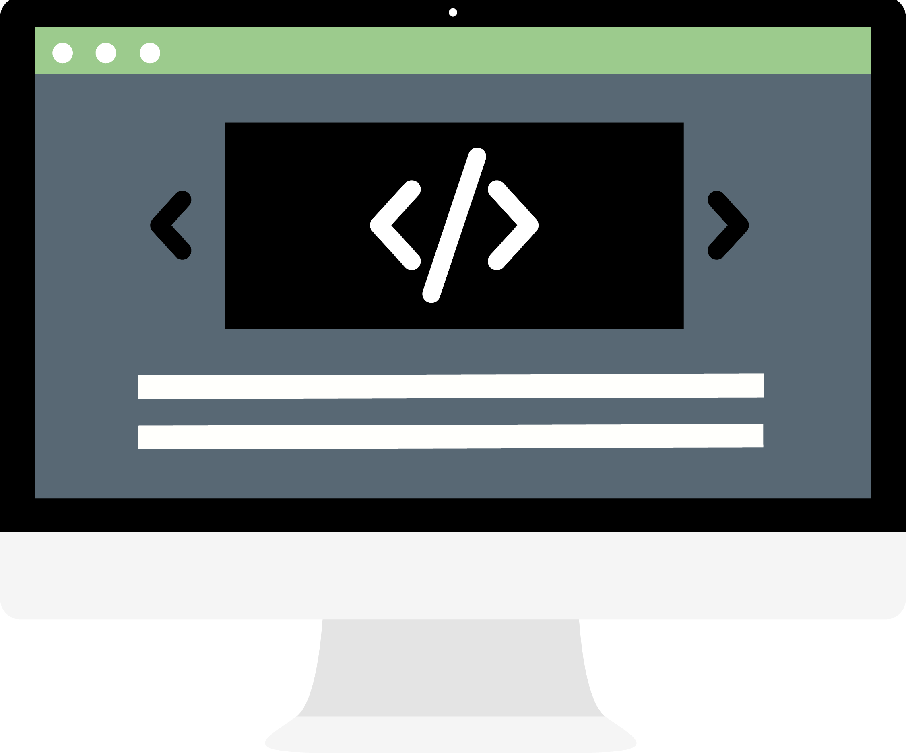

  

<h1 align="center">The Dev Toolkit</h1>
<h6 align="center">The Dev Toolkit is a compiliation of resources for people learning web development, or anyone who is looking for development resources. A general description of the content can be found below:</h6>

[Blogs & Articles](https://github.com/benreckas/the-dev-toolkit/blob/master/blogs-and-articles.md) - A list of developers, blogs, and articles to help you find knowledge and inspiration.

[Dev Tools](https://github.com/benreckas/the-dev-toolkit/blob/master/dev-tools.md) - This is a list of online tools that can be used for development. Everything from free code editors to design tools.

[Text Editor Extensions](https://github.com/benreckas/the-dev-toolkit/blob/master/text-editor-extensions.md) - A list of useful editor extensions.

[Learning Resources](https://github.com/benreckas/the-dev-toolkit/blob/master/learning-resources.md) - A list of web development learning resources for a variety of languages and technologies.

[Learn how to contribute](https://github.com/benreckas/the-dev-toolkit/blob/master/contributing.md) to The Dev Toolkit.
